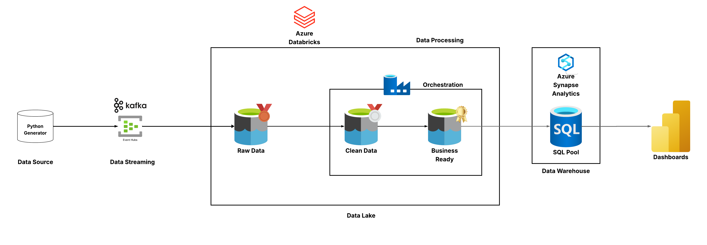
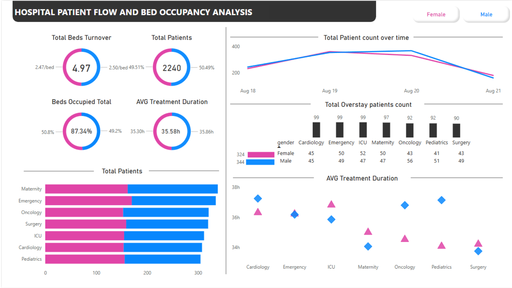

# Azure Patient Flow Analytics Warehouse + Power BI Dashboard

> An end-to-end real-time analytics platform for hospital patient flow monitoring using Azure cloud services, medallion architecture, and Power BI dashboards.

[](https://opensource.org/licenses/MIT)

---

## Table of Contents
- [Overview](#overview)
- [Business Context](#business-context)
- [Architecture](#architecture)
- [Technology Stack](#technology-stack)
- [Data Pipeline](#data-pipeline)
- [Data Model](#data-model)
- [Dashboard](#dashboard)
- [Project Structure](#project-structure)
- [Setup and Installation](#setup-and-installation)
- [Usage](#usage)
- [Key Features](#key-features)
- [Future Enhancements](#future-enhancements)
- [Documentation](#documentation)
- [License](#license)
- [Author](#author)

---

## Overview

This project demonstrates a production-grade real-time analytics pipeline for healthcare operations. It simulates hospital patient flow data, processes it through a medallion architecture (Bronze → Silver → Gold), and delivers actionable insights through an interactive Power BI dashboard.

The platform enables hospital operations teams to:
- Monitor patient admissions and discharges in near real-time
- Identify department-level bottlenecks (Emergency, ICU, Surgery, etc.)
- Track bed occupancy and utilization metrics
- Analyze treatment duration trends
- View demographic breakdowns by gender and age

**Note:** All data used in this project is synthetic and generated for demonstration purposes only. No real patient information is used.

---

## Business Context

### The Problem
Midwest Health Alliance (MHA), a network of seven hospitals, faces challenges in monitoring patient flow across departments during high-demand periods. Data is scattered across multiple systems, making it difficult to:
- Identify capacity constraints in real-time
- Detect bottlenecks early
- Make data-driven operational decisions
- Respond quickly to surges in patient volume

### The Solution
A centralized, near real-time analytics platform that:
- Ingests streaming patient events from registration systems
- Processes and cleanses data through a medallion architecture
- Provides a star schema data warehouse for analytics
- Delivers operational dashboards for decision-makers

---

## Architecture



### High-Level Flow

1. **Data Generation**: Python script simulates patient admission/discharge events
2. **Data Streaming**: Events are streamed to Azure Event Hubs via Kafka protocol
3. **Data Processing**: Azure Databricks processes data through three layers:
   - **Bronze Layer**: Raw data ingestion (append-only)
   - **Silver Layer**: Data cleansing and standardization
   - **Gold Layer**: Business-ready dimensional model
4. **Data Warehousing**: Azure Synapse Analytics SQL Pool serves curated data
5. **Visualization**: Power BI connects to Synapse for interactive dashboards

### Key Design Patterns

- **Medallion Architecture**: Progressive data refinement through Bronze → Silver → Gold layers
- **Star Schema**: Dimensional modeling with fact and dimension tables for optimal query performance
- **SCD Type 2**: Slowly Changing Dimensions to track historical changes in patient attributes
- **Delta Lake**: ACID transactions and time travel capabilities for data reliability
- **Schema Evolution**: Graceful handling of new attributes without pipeline breakage

---

## Technology Stack

| Component | Technology | Purpose |
|-----------|-----------|---------|
| **Data Generation** | Python | Synthetic patient event generator |
| **Streaming** | Azure Event Hubs | Real-time event ingestion |
| **Processing** | Azure Databricks | PySpark-based ETL pipelines |
| **Storage** | Azure Data Lake Storage Gen2 | Scalable data lake for all layers |
| **File Format** | Delta Lake | ACID-compliant storage with versioning |
| **Data Warehouse** | Azure Synapse Analytics | SQL-based serving layer |
| **Visualization** | Power BI Desktop | Interactive dashboards |
| **Orchestration** | Azure Data Factory (planned) | Pipeline automation and scheduling |

---

## Data Pipeline

### 1. Bronze Layer (Raw Data)
**Notebook**: `notebooks/01_bronze_rawdata.py`

- Reads streaming events from Azure Event Hubs using Kafka protocol
- Writes raw JSON data to Delta Lake with minimal transformation
- Append-only design for data lineage and reprocessing capability
- Checkpoint management for fault tolerance

### 2. Silver Layer (Cleaned Data)
**Notebook**: `notebooks/02_silver_cleandata.py`

Applies data quality rules:
- **Type Conversion**: Converts string timestamps to proper datetime types
- **Invalid Age Handling**: Replaces ages > 100 with random valid values (1-90)
- **Future Timestamp Correction**: Fixes admission times that occur in the future
- **Schema Evolution**: Adds missing expected columns with null values
- **Null Handling**: Replaces invalid admission times with current timestamp

### 3. Gold Layer (Business-Ready)
**Notebook**: `notebooks/03_gold_transform.py`

Creates a star schema with:

#### Dimension Tables
- **`dim_patient`**: Patient demographics with SCD Type 2 implementation
  - Tracks changes in gender and age over time
  - Includes surrogate keys, effective dates, and current flag
  - Uses SHA-256 hashing to detect attribute changes
  
- **`dim_department`**: Department and hospital reference data
  - Surrogate key for each department-hospital combination
  - Supports multiple departments across hospital network

#### Fact Table
- **`fact_patient_flow`**: Patient admission/discharge events
  - Foreign keys to patient and department dimensions
  - Metrics: length of stay (hours), admission/discharge timestamps
  - Flags: is_currently_admitted status
  - Partitioned by admission_date for query optimization

---

## Data Model

### Star Schema Design

```
fact_patient_flow (Fact Table)
├── fact_id (PK)
├── patient_sk (FK → dim_patient)
├── department_sk (FK → dim_department)
├── admission_time
├── discharge_time
├── admission_date
├── length_of_stay_hours
├── is_currently_admitted
├── bed_id
└── event_ingestion_time

dim_patient (Dimension - SCD Type 2)
├── surrogate_key (PK)
├── patient_id (Natural Key)
├── gender
├── age
├── effective_from
├── effective_to
└── is_current

dim_department (Dimension)
├── surrogate_key (PK)
├── department
└── hospital_id
```

### Data Warehouse (Synapse SQL Pool)

**Scripts**: `sql/pool_queries.sql` and `sql/views.sql`

- External tables pointing to Gold layer Delta files
- Parquet file format for efficient querying
- Managed Identity authentication for secure access
- Views for simplified Power BI connectivity

---

## Dashboard



### Key Performance Indicators (KPIs)

**Operational Metrics**
- **Total Patients**: Overall patient count with gender breakdown (2,240 patients)
- **Beds Occupied**: Current occupancy rate (87.34%)
- **Bed Turnover**: Average turnover rate per bed (4.97/bed)
- **Average Treatment Duration**: Mean length of stay (35.58 hours)

**Visualizations**
1. **Patient Count Over Time**: Line chart showing admission trends by gender
2. **Overstay Analysis**: Bar chart of patients exceeding expected stay by department
3. **Department Distribution**: Horizontal bar chart of patient volume by department and gender
4. **Treatment Duration Scatter**: Department-wise treatment duration patterns

**Interactive Features**
- Gender filter (Male/Female toggle buttons)
- Department drill-down capabilities
- Time-based trend analysis
- Cross-filtering across all visuals

**File Location**: `powerbi/Azure Patient Flow Analytics Warehouse and Power BI Dashboard.pbix`

---

## Project Structure

```
.
├── data/
│   └── patient_flow_generator.py      
├── docs/
│   ├── client_requirements.md         
│   └── SRS.md                          
├── notebooks/
│   ├── 01_bronze_rawdata.py           
│   ├── 02_silver_cleandata.py         
│   └── 03_gold_transform.py           
├── powerbi/
│   └── Azure Patient Flow Analytics Warehouse and Power BI Dashboard.pbix
├── screenshots/
│   ├── architecture.png               
│   └── powerbi_dashboard.png          
├── sql/
│   ├── pool_queries.sql               
│   └── views.sql                      
└── README.md
```

---

## Setup and Installation

### Prerequisites

Ensure you have the following Azure resources provisioned:

1. **Azure Subscription** with appropriate permissions
2. **Azure Event Hubs**
   - Namespace created
   - Event Hub instance created
   - Connection string obtained
3. **Azure Databricks Workspace**
   - Cluster configured with Spark 3.x
   - Delta Lake support enabled
4. **Azure Data Lake Storage Gen2**
   - Storage account created
   - Containers for Bronze, Silver, and Gold layers
   - Access keys or Managed Identity configured
5. **Azure Synapse Analytics**
   - Synapse workspace created
   - Dedicated SQL Pool provisioned
   - Managed Identity enabled
6. **Power BI Desktop** installed locally

### Configuration Steps

#### Step 1: Configure Event Streaming

1. Create an Azure Event Hubs namespace and Event Hub instance
2. Obtain the connection string from Azure Portal
3. Update `data/patient_flow_generator.py`:
   ```python
   EVENTHUBS_NAMESPACE = "your-namespace.servicebus.windows.net"
   EVENT_HUB_NAME = "your-eventhub-name"
   CONNECTION_STRING = "your-connection-string"
   ```

#### Step 2: Configure Databricks Notebooks

Update the following placeholders in all three notebooks:

**Bronze Notebook** (`01_bronze_rawdata.py`):
```python
event_hub_namespace = "your-namespace.servicebus.windows.net"
event_hub_name = "your-eventhub-name"
event_hub_conn_str = "your-connection-string"
bronze_path = "abfss://container@storageaccount.dfs.core.windows.net/bronze/patient_flow"
```

**Silver Notebook** (`02_silver_cleandata.py`):
```python
bronze_path = "abfss://container@storageaccount.dfs.core.windows.net/bronze/patient_flow"
silver_path = "abfss://container@storageaccount.dfs.core.windows.net/silver/patient_flow"
```

**Gold Notebook** (`03_gold_transform.py`):
```python
silver_path = "abfss://container@storageaccount.dfs.core.windows.net/silver/patient_flow"
gold_dim_patient = "abfss://container@storageaccount.dfs.core.windows.net/gold/dim_patient"
gold_dim_department = "abfss://container@storageaccount.dfs.core.windows.net/gold/dim_department"
gold_fact = "abfss://container@storageaccount.dfs.core.windows.net/gold/fact_patient_flow"
```

**Storage Authentication**:
Add to each notebook:
```python
spark.conf.set(
    "fs.azure.account.key.your-storage-account.dfs.core.windows.net",
    "your-storage-account-access-key"
)
```

#### Step 3: Configure Synapse SQL Pool

1. Open Synapse Studio and navigate to your SQL Pool
2. Update `sql/pool_queries.sql` with your storage details:
   ```sql
   CREATE MASTER KEY ENCRYPTION BY PASSWORD = 'YourStrongPassword123!';
   
   CREATE EXTERNAL DATA SOURCE gold_data_source
   WITH (
       TYPE = HADOOP,
       LOCATION = 'abfss://container@storageaccount.dfs.core.windows.net/gold/',
       CREDENTIAL = storage_credential
   );
   ```
3. Execute the script to create external tables

---

## Usage

### Running the Pipeline

#### 1. Start Event Generation
```bash
cd data
python patient_flow_generator.py
```
This will continuously generate synthetic patient events and stream them to Event Hubs (1 event per second).

#### 2. Run Databricks Notebooks (in order)

**Bronze Layer**:
- Open `notebooks/01_bronze_rawdata.py` in Databricks
- Attach to your cluster
- Run all cells
- Verify streaming query is running

**Silver Layer**:
- Open `notebooks/02_silver_cleandata.py`
- Run all cells
- Monitor data quality transformations

**Gold Layer**:
- Open `notebooks/03_gold_transform.py`
- Run all cells
- Verify dimension and fact tables are created
- Check row counts in output

#### 3. Create Warehouse Objects

In Synapse SQL Pool:
```sql
-- Execute pool_queries.sql to create external tables
-- Execute views.sql to create reporting views (if needed)
```

#### 4. Refresh Power BI Dashboard

1. Open `powerbi/Azure Patient Flow Analytics Warehouse and Power BI Dashboard.pbix`
2. Click **Transform Data** → **Data source settings**
3. Update connection string to your Synapse SQL Pool endpoint
4. Enter credentials (Azure AD or SQL authentication)
5. Click **Refresh** to load latest data
6. Explore the dashboard visuals

---

## Key Features

### Data Quality Management
- **Dirty Data Injection**: Generator intentionally creates 5% invalid records (future dates, invalid ages)
- **Automated Cleansing**: Silver layer detects and corrects data quality issues
- **Validation Logging**: Transformations are logged for audit purposes

### Scalability
- **Streaming Architecture**: Handles continuous event ingestion
- **Delta Lake**: Supports ACID transactions and concurrent reads/writes
- **Partitioning**: Fact table partitioned by date for query optimization
- **Incremental Processing**: Checkpoint-based streaming for fault tolerance

### Data Governance
- **Schema Evolution**: Gracefully handles new columns without breaking pipelines
- **SCD Type 2**: Maintains historical accuracy for changing attributes
- **Lineage**: Clear data flow from Bronze → Silver → Gold
- **Replay Capability**: Bronze layer enables reprocessing from raw data

### Analytics Capabilities
- **Star Schema**: Optimized for BI query performance
- **Pre-aggregated Metrics**: Length of stay, occupancy flags computed in Gold layer
- **Flexible Filtering**: Dashboard supports multi-dimensional analysis
- **Real-time Insights**: Near real-time refresh capabilities

---

## Future Enhancements

### High Priority
1. **Azure Data Factory Integration**
   - Automate end-to-end pipeline orchestration
   - Schedule daily batch processing
   - Implement monitoring and alerting
   - Add retry logic for failed steps

2. **Enhanced Data Quality**
   - Create data quality report table with issue counts
   - Add data profiling metrics
   - Implement anomaly detection for outliers
   - Build data quality dashboard

3. **Department Metadata**
   - Add department capacity and staffing reference tables
   - Calculate occupancy percentage based on actual capacity
   - Include shift schedules for workload analysis

### Medium Priority
4. **Batch EHR Integration**
   - Add daily batch ingestion path alongside streaming
   - Merge streaming and batch data in Silver layer
   - Handle late-arriving data scenarios

5. **Advanced Security**
   - Implement Row-Level Security (RLS) in Power BI
   - Add department-level access controls
   - Enable Azure AD authentication throughout
   - Implement data masking for sensitive fields

6. **Monitoring and Observability**
   - Azure Monitor integration for pipeline health
   - Alert routing for failures
   - Performance metrics dashboard
   - Cost tracking and optimization

### Long-term
7. **Predictive Analytics**
   - ML models for occupancy forecasting
   - Staffing demand prediction
   - Patient readmission risk scoring
   - Length of stay prediction

8. **Additional Dashboards**
   - Executive summary dashboard
   - Department-specific operational views
   - Staffing and resource allocation dashboard
   - Financial impact analysis

9. **Production Hardening**
   - Environment separation (Dev/Test/Prod)
   - CI/CD pipeline with automated testing
   - Disaster recovery and backup strategy
   - Full HIPAA compliance implementation

---

## Documentation

### Included Documents

- **`docs/client_requirements.md`**: Simulated business requirements from Midwest Health Alliance COO
  - Business background and objectives
  - Functional requirements
  - Success criteria
  - Deliverables

- **`docs/SRS.md`**: Software Requirements Specification
  - Detailed technical requirements
  - System architecture overview
  - Data model specifications
  - Acceptance criteria
  - Future enhancement roadmap

### Additional Resources

- **Architecture Diagram**: `screenshots/architecture.png`
- **Dashboard Screenshot**: `screenshots/powerbi_dashboard.png`
- **SQL Scripts**: `sql/` directory for warehouse setup
- **Notebooks**: `notebooks/` directory with inline documentation

---

## Lessons Learned

### What Worked Well
- **Medallion Architecture**: Clear separation of concerns made debugging easier
- **Delta Lake**: ACID properties and time travel were invaluable for development
- **Star Schema**: Simplified Power BI data modeling and improved query performance
- **SCD Type 2**: Enabled historical analysis without complex queries

### Challenges Overcome
- **Streaming Checkpoints**: Required careful management to avoid state corruption
- **Schema Evolution**: Needed explicit column handling in Silver layer
- **SCD Type 2 Implementation**: Complex merge logic required thorough testing
- **Power BI Performance**: Optimized with proper indexing and partitioning

### Best Practices Applied
- Configuration externalization (no hardcoded credentials)
- Incremental processing with checkpoints
- Idempotent transformations where possible
- Comprehensive documentation throughout

---

## Contributing

This is a portfolio/demonstration project. If you'd like to use it as a template:

1. Fork the repository
2. Update configuration files with your Azure resource details
3. Customize the data model for your use case
4. Extend with additional features as needed

Feel free to open issues for questions or suggestions.

---

## License

MIT License

Copyright (c) 2026 Tharanitharan Muthuthirumaran

Permission is hereby granted, free of charge, to any person obtaining a copy
of this software and associated documentation files (the "Software"), to deal
in the Software without restriction, including without limitation the rights
to use, copy, modify, merge, publish, distribute, sublicense, and/or sell
copies of the Software, and to permit persons to whom the Software is
furnished to do so, subject to the following conditions:

The above copyright notice and this permission notice shall be included in all
copies or substantial portions of the Software.

THE SOFTWARE IS PROVIDED "AS IS", WITHOUT WARRANTY OF ANY KIND, EXPRESS OR
IMPLIED, INCLUDING BUT NOT LIMITED TO THE WARRANTIES OF MERCHANTABILITY,
FITNESS FOR A PARTICULAR PURPOSE AND NONINFRINGEMENT. IN NO EVENT SHALL THE
AUTHORS OR COPYRIGHT HOLDERS BE LIABLE FOR ANY CLAIM, DAMAGES OR OTHER
LIABILITY, WHETHER IN AN ACTION OF CONTRACT, TORT OR OTHERWISE, ARISING FROM,
OUT OF OR IN CONNECTION WITH THE SOFTWARE OR THE USE OR OTHER DEALINGS IN THE
SOFTWARE.

---

## Author

**Tharanitharan Muthuthirumaran**

Data Engineer | Azure Cloud Specialist

This project demonstrates expertise in:
- Azure cloud services (Event Hubs, Databricks, Synapse, ADLS Gen2)
- Real-time data streaming and processing
- Medallion architecture and data lake design
- Dimensional modeling and data warehousing
- Power BI dashboard development
- PySpark and SQL programming
- Data quality and governance practices

---

## Acknowledgments

- Inspired by real-world healthcare analytics challenges
- Built following Azure best practices and design patterns
- Implements industry-standard medallion architecture
- Uses synthetic data to demonstrate production-grade capabilities

---

**⭐ If you find this project helpful, please consider giving it a star!**

For questions or collaboration opportunities, feel free to reach out.
